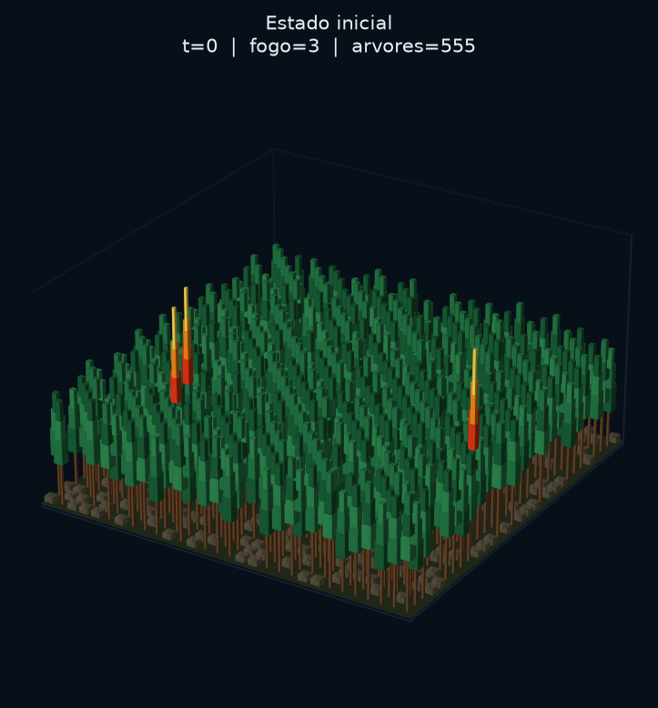
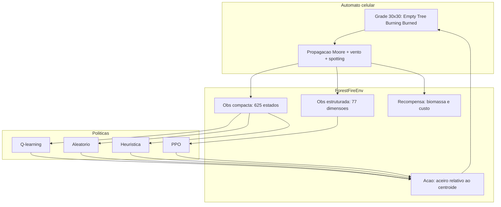
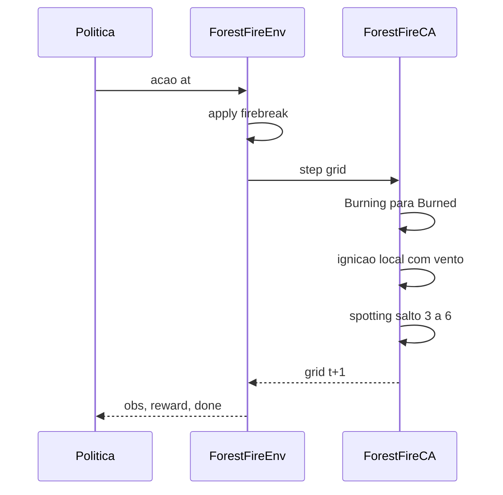
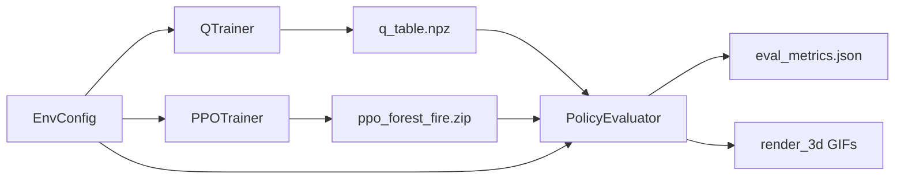
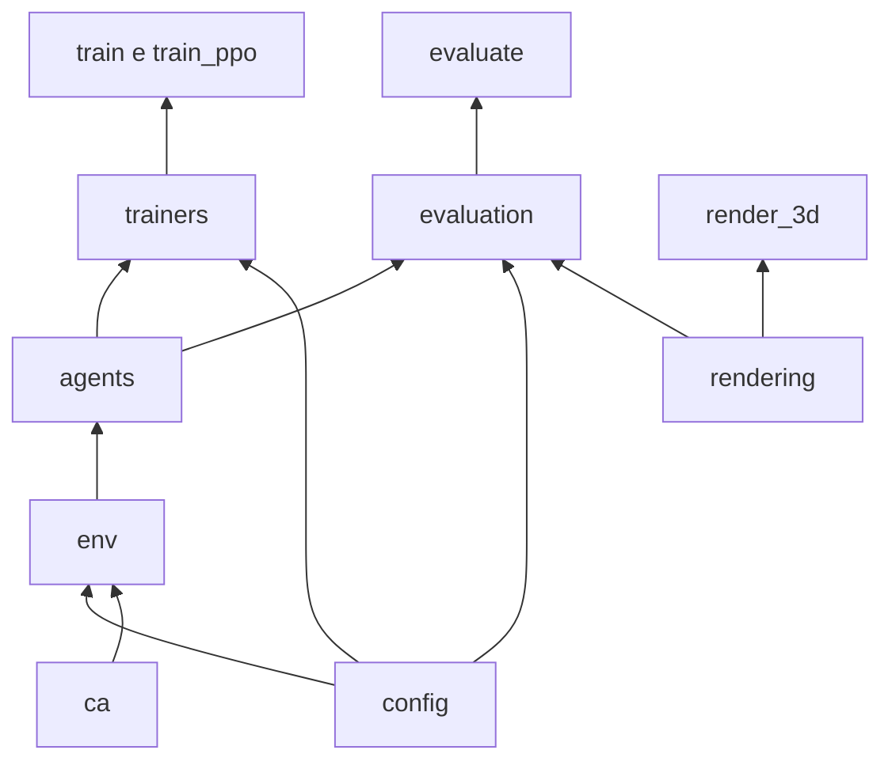

# Representação do Estado em Aprendizado por Reforço para Controle de Incêndios em Autômatos Celulares

Repositório da disciplina de Autômatos Celulares (DEINFO / UFRPE). Implementa um autômato celular de incêndio florestal com vento e spotting, acoplado a um MDP Gymnasium em que o agente abre aceiros. Quatro políticas são avaliadas no **mesmo ambiente e nas mesmas seeds**: aleatória, heurística, Q-learning tabular e PPO.

Artigo: [`paper/article.pdf`](paper/article.pdf) · código fonte LaTeX: [`paper/article.tex`](paper/article.tex)

## Visualização (seed 340)

Comparação 3D das quatro políticas:


Stills do artigo (início e finais por política):

| t = 0 | Sem controle | Heurística |
|:-----:|:------------:|:----------:|
|  |  |  |

| Q-learning | PPO |
|:----------:|:---:|
|  |  |

Resumo quantitativo (100 episódios, seeds 1000 a 1099):


| Política   | Árvores salvas (média ± dp) | Retorno (média) |
|------------|-----------------------------|-----------------|
| Aleatório  | 0,527 ± 0,202               | −7,46           |
| Q-learning | 0,547 ± 0,213               | −4,38           |
| Heurística | 0,559 ± 0,228               | −5,94           |
| PPO        | 0,610 ± 0,229               | +4,79           |

## Arquitetura do sistema



## Pipeline de um passo



## Fluxo de treino e avaliação



## Modelo do autômato

Estados por célula: `EMPTY=0`, `TREE=1`, `BURNING=2`, `BURNED=3`.

A cada tick (`ForestFireCA.step`):

1. Células `BURNING` passam a `BURNED`.
2. Cada `TREE` com vizinho `BURNING` na vizinhança de Moore ignora com probabilidade modulada pelo alinhamento ao vento constante `(0, 1)` (leste) e `wind_boost=2.0`.
3. Spotting: com probabilidade `p_spot=0.28`, brasas saltam `spot_min..spot_max` em {3,...,6} células na direção do vento e podem acender `TREE` remotas.
4. `p_grow=0.0` (sem regeneração durante o episódio de combate).

Parâmetros canônicos em `src/config.py` (`EnvConfig`):

| Parâmetro | Valor |
|-----------|-------|
| `size` | 30 |
| `coarse` | 5 (regiões 6×6) |
| `tree_density` | 0,60 |
| `n_ignitions` | 3 |
| `p_spread` | 0,90 |
| `wind` | (0, 1) |
| `wind_boost` | 2,0 |
| `p_spot` | 0,28 |
| `spot_min` / `spot_max` | 3 / 6 |
| `cells_per_action` | 8 |
| `max_steps` | 70 |

## MDP de controle

- **Ação**: Discrete(10). Nove deslocamentos relativos ao centroide do fogo em grade `coarse×coarse`, mais no-op. Em cada ação efetiva, até `cells_per_action` árvores na região alvo são convertidas em `EMPTY` (aceiro).
- **Observação compacta** (Q-learning / baselines): `(região_do_fogo, bin_intensidade, bin_biomassa)` → 25 × 5 × 5 = **625** estados.
- **Observação estruturada** (PPO): vetor de **77** dimensões (mapa coarse de estados, estatísticas locais, vento/spotting normalizados). Ver `RichObservationEncoder` / `compute_rich_obs`.
- **Recompensa**: fração de biomassa preservada relativa ao custo de abertura de aceiro (detalhe em `ForestFireEnv.step`).
- **Término**: ausência de `BURNING` ou `max_steps`.

## Políticas

| Política | Observação | Critério |
|----------|------------|----------|
| Aleatório | compacta | amostragem uniforme em `A` |
| Heurística | compacta | ação 0 (centroide) enquanto houver fogo |
| Q-learning | compacta | tabela Q, ε-greedy, α=0,25, γ=0,95 |
| PPO | estruturada 77-D | Stable-Baselines3 `MlpPolicy` |

Justiça experimental: `make_default_env()` instancia o mesmo `EnvConfig` para treino, avaliação e renderização. `PolicyEvaluator` percorre seeds `seed, seed+1, ...` idênticas para todas as políticas.

## Organização do código

```
src/
  config.py                 EnvConfig, make_default_env
  ca/                       ForestFireCA, estados
  env.py                    ForestFireEnv, encoders
  agents/                   Policy, QLearningAgent, PPOPolicy, baselines
  trainers/                 QTrainer, PPOTrainer
  evaluation/               EpisodeRunner, PolicyEvaluator
  rendering/                plots 2D, cena 3D
  train.py                  CLI Q-learning
  train_ppo.py              CLI PPO
  evaluate.py               CLI avaliação
  render_3d.py              CLI GIFs 3D
paper/                      artigo + figuras Plotly
results/                    métricas, modelos, animações
prompts/                    registro de prompts de IA
```

Diagrama de dependências entre pacotes:



Classes principais: `EnvConfig`, `ForestFireCA`, `ForestFireEnv`, `CompactObservationEncoder`, `RichObservationEncoder`, `QLearningAgent`, `PPOPolicy`, `HeuristicPolicy`, `QTrainer`, `PPOTrainer`, `EpisodeRunner`, `PolicyEvaluator`.

## Instalação

```bash
python3 -m venv .venv
source .venv/bin/activate
pip install -r requirements.txt
```

Dependências principais: `numpy`, `gymnasium`, `stable-baselines3`, `matplotlib`, `imageio`, `plotly`, `kaleido`.

## Reprodução

```bash
# Treino
python -m src.train --episodes 3000 --out results
python -m src.train_ppo --timesteps 200000 --out results

# Avaliação (seeds 1000 a 1099 por omissão)
python -m src.evaluate --episodes 100 --seed 1000 --out results

# Render 3D (seed ilustrativa 340)
python -m src.render_3d --compare4 --seed 340 --out results/forest_fire_3d_4algos.gif
python -m src.render_3d --policy PPO --seed 340 --out results/forest_fire_3d_ppo.gif

# Figuras do artigo
python paper/make_figures.py
cd paper && tectonic article.tex
```

Artefactos esperados em `results/`: `q_table.npz`, `ppo_forest_fire.zip`, `eval_metrics.json`, curvas de aprendizado, GIFs 3D.

## Artigo

Compilar com [Tectonic](https://tectonic-typesetting.github.io/):

```bash
cd paper && tectonic article.tex
```

Figuras geradas por `paper/make_figures.py` a partir de `results/eval_metrics.json` e dos retornos de treino.

## Licença e uso

Material académico da disciplina. Uso e redistribuição conforme as regras do curso.
