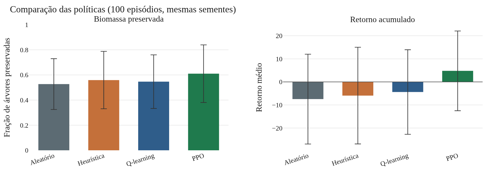
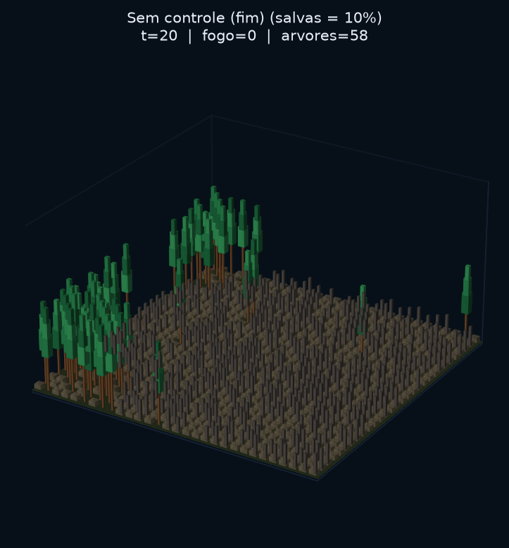
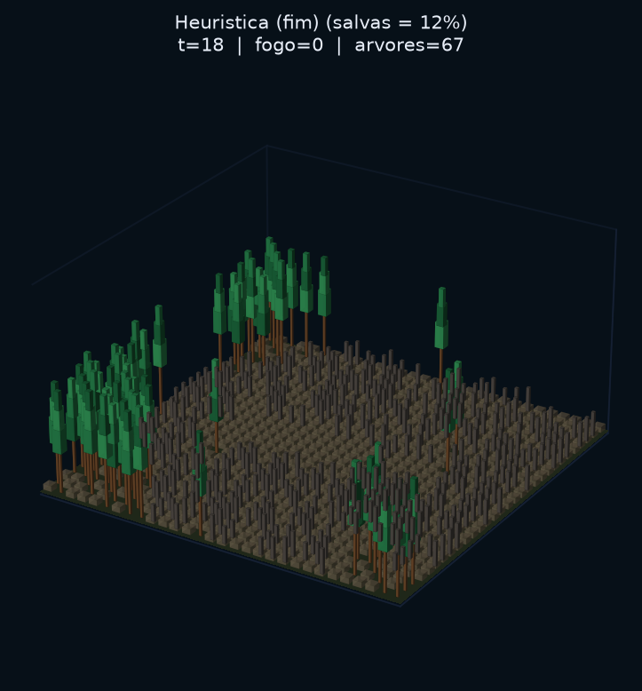
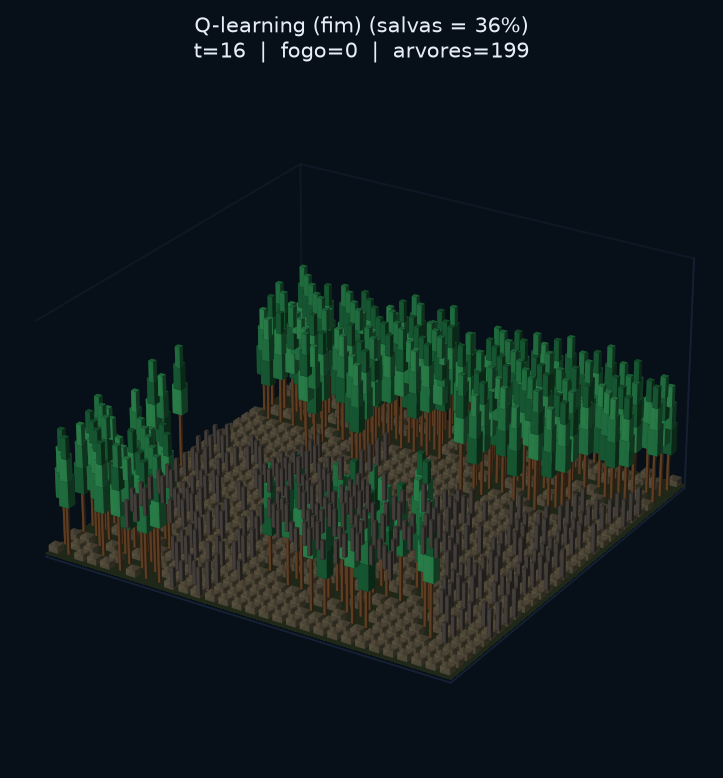
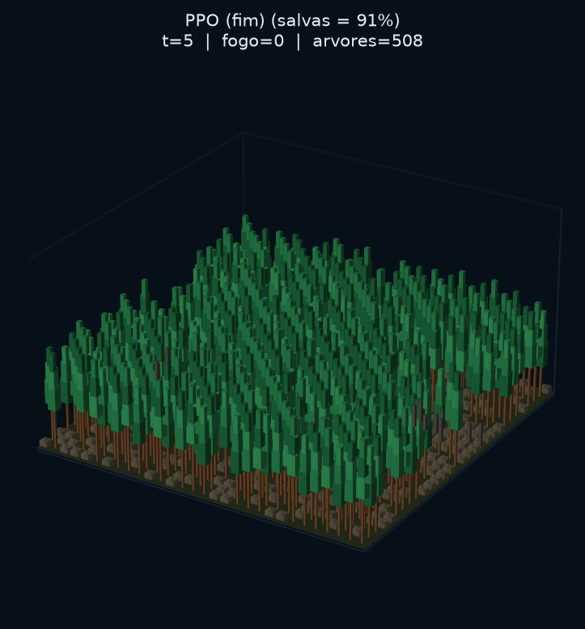

# Representação do Estado em Aprendizado por Reforço para Controle de Incêndios em Autômatos Celulares

Repositório da disciplina de Autômatos Celulares (DEINFO / UFRPE). O projeto acopla um **autômato celular de incêndio florestal** (vento + spotting) a um **MDP Gymnasium** em que um agente abre aceiros para preservar biomassa. Quatro políticas são comparadas no **mesmo ambiente e nas mesmas seeds**: aleatória, heurística, Q-learning tabular e PPO.

Artigo completo: [`paper/article.pdf`](paper/article.pdf) ([`article.tex`](paper/article.tex)).

## Visão geral

O núcleo físico é a grade celular. A cada tick, o fogo se propaga por vizinhança de Moore, é enviesado por vento constante a leste e pode saltar (spotting). O agente não apaga células em chamas: ele remove combustível (`TREE` → `EMPTY`) em uma região relativa ao centroide do fogo, com orçamento limitado por passo. Em seguida o autômato avança um tick e a recompensa mede biomassa preservada versus custo do aceiro.


A justiça experimental é central: `EnvConfig` / `make_default_env()` fixam os parâmetros canônicos. Treino, avaliação e renderização usam a mesma fábrica. Na avaliação, `PolicyEvaluator` percorre seeds idênticas para todas as políticas, de modo que a diferença observada se deve ao algoritmo e à observação, não a realizações distintas do fogo.

## Visualização (seed 340)

Comparação 3D das quatro políticas sobre a mesma realização estocástica (figuras análogas às do artigo):


Nesta seed ilustrativa, o PPO preserva cerca de 91% das árvores, contra ~36% do Q-learning, ~17% do aleatório e ~12% da heurística. O gráfico abaixo resume o desempenho médio em 100 episódios (seeds 1000 a 1099):



| Política   | Árvores salvas (média ± dp) | Retorno (média) |
|------------|-----------------------------|-----------------|
| Aleatório  | 0,527 ± 0,202               | −7,46           |
| Q-learning | 0,547 ± 0,213               | −4,38           |
| Heurística | 0,559 ± 0,228               | −5,94           |
| PPO        | 0,610 ± 0,229               | +4,79           |

Testes t pareados (mesmas seeds): PPO supera aleatório (p = 3,4e-4),
heurística (p = 0,011) e Q-learning (p = 0,0049) em biomassa.

Stills finais do artigo (sem controle, heurística, Q-learning, PPO), a partir do mesmo estado inicial:

| Sem controle | Heurística | Q-learning | PPO |
|:------------:|:----------:|:----------:|:---:|
|  |  |  |  |

## Autômato celular

Estados por célula: `EMPTY=0`, `TREE=1`, `BURNING=2`, `BURNED=3`. A classe `ForestFireCA` implementa um passo vetorizado:

1. Células `BURNING` tornam-se `BURNED`.
2. Cada `TREE` com vizinho `BURNING` (Moore) pode inflamarse. A probabilidade base `p_spread` é modulada pelo alinhamento ao vento `(0, 1)` (leste) via `wind_boost`: a favor do vento a ignição fica mais provável; contra o vento, menos.
3. Com probabilidade `p_spot`, brasas saltam entre `spot_min` e `spot_max` células na direção do vento e podem acender árvores remotas (spotting).
4. `p_grow=0.0`: não há regeneração durante o episódio de combate.

Parâmetros canônicos (`src/config.py`):

| Parâmetro | Valor | Papel |
|-----------|-------|--------|
| `size` | 30 | Lado da grade |
| `coarse` | 5 | Partição em 25 regiões (blocos 6×6) |
| `tree_density` | 0,60 | Densidade inicial de árvores |
| `n_ignitions` | 3 | Focos iniciais |
| `p_spread` | 0,90 | Probabilidade base de espalhamento |
| `wind` / `wind_boost` | (0, 1) / 2,0 | Direção e intensidade do viés |
| `p_spot` / salto | 0,28 / 3–6 | Spotting |
| `cells_per_action` | 8 | Orçamento de aceiro por passo |
| `max_steps` | 70 | Horizonte do episódio |

## Problema de controle (MDP)

`ForestFireEnv` encapsula o CA em uma API Gymnasium. Em cada passo:

1. O agente escolhe uma ação em `Discrete(10)`: nove deslocamentos relativos ao centroide do fogo na grade `coarse×coarse`, mais no-op.
2. Até `cells_per_action` árvores na região alvo são convertidas em `EMPTY` (aceiro).
3. O CA avança um tick.
4. A recompensa combina biomassa preservada e custo do aceiro; o episódio termina quando não há mais `BURNING` ou se atinge `max_steps`.

Há duas representações de observação, alinhadas às capacidades de cada algoritmo:

- **Compacta** (baselines e Q-learning): tupla `(região_do_fogo, bin_de_fogo, bin_de_árvores)`, totalizando 25 × 5 × 5 = **625** estados discretos. Adequada a tabela Q, mas perde geometria fina da frente de fogo.
- **Estruturada** (PPO): vetor contínuo de **77** dimensões (mapa coarse de ocupação, estatísticas locais, parâmetros de vento/spotting normalizados). Permite à política MLP explorar correlações espaciais que o índice tabular não captura.

## Políticas e treino

| Política | Observação | Comportamento |
|----------|------------|---------------|
| Aleatório | compacta | Amostragem uniforme em `A` |
| Heurística | compacta | Sempre ação 0 (região do centroide) enquanto houver fogo |
| Q-learning | compacta | Tabela Q, ε-greedy, α=0,25, γ=0,95; 3000 episódios |
| PPO | estruturada 77-D | Stable-Baselines3 `MlpPolicy`; 200k timesteps |

A heurística é um baseline forte e interpretável (aceiro na frente aparente do fogo). O Q-learning opera no mesmo espaço de estados da heurística e do aleatório; o PPO recebe a observação estruturada. Essa assimetria de observação é deliberada e discutida no artigo: o objetivo não é isolar o otimizador em observação idêntica, e sim comparar políticas tipicamente usadas em cada regime (tabular vs. contínuo).

Artefactos de treino/avaliação em `results/`: `q_table.npz`, `ppo_forest_fire.zip`, `eval_metrics.json`, curvas e GIFs.

## Organização do código

```
src/
  config.py       EnvConfig (fonte única de parâmetros)
  ca/             ForestFireCA e estados
  env.py          ForestFireEnv e encoders de observação
  agents/         Policy, QLearningAgent, PPOPolicy, baselines
  trainers/       QTrainer, PPOTrainer
  evaluation/     EpisodeRunner, PolicyEvaluator
  rendering/      plots 2D e cena 3D
  train.py        CLI Q-learning
  train_ppo.py    CLI PPO
  evaluate.py     CLI avaliação
  render_3d.py    CLI GIFs 3D
paper/            artigo LaTeX e figuras
results/          métricas, modelos e animações
prompts/          prompts de IA em XML (inglês)
```

Os prompts usados com assistência por IA estão em [`prompts/`](prompts/), em inglês e XML (`role`, `context`, `chain_of_ideas`, `constraints`, `repeat_critical`, `deliverables`).


Fluxo típico: configurar via `EnvConfig` → treinar com `QTrainer` / `PPOTrainer` → avaliar com `PolicyEvaluator` (seeds compartilhadas) → renderizar com `render_3d`.

## Instalação e reprodução

```bash
python3 -m venv .venv
source .venv/bin/activate
pip install -r requirements.txt

python -m src.train --episodes 3000 --out results
python -m src.train_ppo --timesteps 200000 --out results
python -m src.evaluate --episodes 100 --seed 1000 --out results

python -m src.render_3d --compare4 --seed 340 --out results/forest_fire_3d_4algos.gif
python paper/make_figures.py
cd paper && tectonic article.tex
```

Dependências principais: `numpy`, `gymnasium`, `stable-baselines3`, `matplotlib`, `imageio`, `plotly`, `kaleido`.

## Licença

Material académico da disciplina. Uso e redistribuição conforme as regras do curso.
